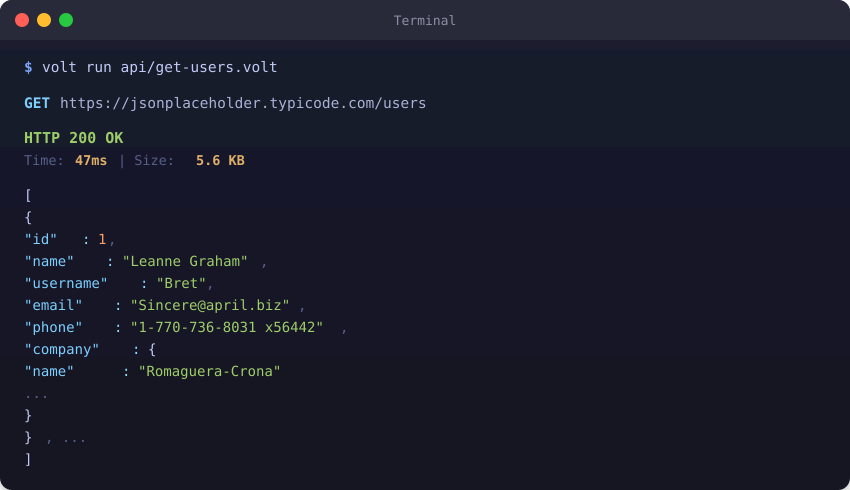
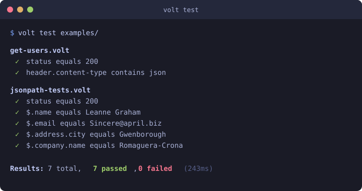
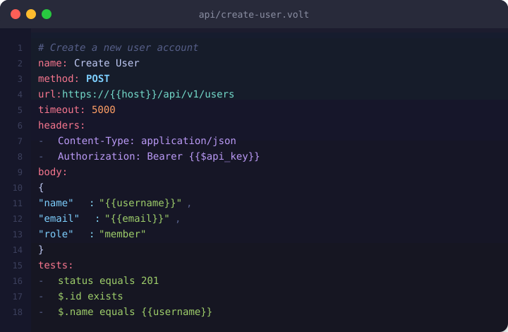
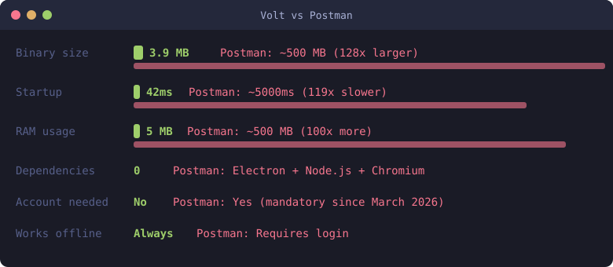

<p align="center">
  <h1 align="center">Volt</h1>
  <p align="center"><strong>The API client that respects you.</strong></p>
  <p align="center">Offline-first. Git-native. Single binary. Zero bloat.</p>
</p>

<p align="center">
  <code>~4 MB binary</code> &nbsp;&middot;&nbsp; <code>&lt;10ms startup</code> &nbsp;&middot;&nbsp; <code>5 MB RAM</code> &nbsp;&middot;&nbsp; <code>0 dependencies</code>
</p>

<p align="center">
  <a href="https://api-volt.com">Website</a> &nbsp;&middot;&nbsp;
  <a href="https://github.com/volt-api/volt"></a>
  <a href="https://github.com/volt-api/volt/releases"></a>
</p>

<p align="center">
  <a href="#install">Install</a> &bull;
  <a href="#quick-start">Quick Start</a> &bull;
  <a href="#the-volt-format">The .volt Format</a> &bull;
  <a href="#how-volt-compares">How Volt Compares</a> &bull;
  <a href="#features">Features</a> &bull;
  <a href="#web-ui">Web UI</a> &bull;
  <a href="docs/getting-started.md">Docs</a> &bull;
  <a href="BENCHMARKS.md">Benchmarks</a>
</p>

---

<p align="center">
  
</p>

Volt is a complete API development toolkit built from scratch in **Zig**. 78 modules, 50,000+ lines, 816 tests — zero external dependencies. Plain-text `.volt` files live in your git repo alongside your code. No account required. No cloud sync. No telemetry. No Electron. Just a single binary that does everything Postman does in 1/100th the size.

> **[Getting Started](docs/getting-started.md)** &nbsp;&middot;&nbsp; **[Command Reference](docs/commands.md)** &nbsp;&middot;&nbsp; **[.volt File Format](docs/volt-file-format.md)**

## Install

```bash
# Linux / macOS
curl -fsSL https://raw.githubusercontent.com/volt-api/volt/main/scripts/install.sh | bash

# Homebrew
brew install volt-api/volt/volt

# Scoop (Windows)
scoop bucket add volt https://github.com/volt-api/scoop-volt && scoop install volt
```

Or download a [pre-built binary](https://github.com/volt-api/volt/releases) — it's a single file, just put it on your PATH.

<details>
<summary><strong>More install options</strong></summary>

### GitHub Actions

```yaml
- uses: volt-api/volt-action@v1
  with:
    command: test
```

### Pre-built Binaries

| Platform | Download |
|----------|----------|
| Linux x86_64 | `volt-linux-x86_64` |
| Linux ARM64 | `volt-linux-aarch64` |
| macOS ARM | `volt-macos-aarch64` |
| macOS Intel | `volt-macos-x86_64` |
| Windows | `volt-windows-x86_64.exe` |

### Build from Source

Requires [Zig 0.14.1](https://ziglang.org/download/):

```bash
git clone https://github.com/volt-api/volt.git && cd volt
zig build -Doptimize=ReleaseFast
# Binary at ./zig-out/bin/volt
```

</details>

## Quick Start

```bash
volt init                               # Initialize project (creates .voltrc)
```

**1. Create a request** — it's just a text file:

```yaml
# api/get-users.volt
name: Get Users
method: GET
url: https://jsonplaceholder.typicode.com/users
headers:
  - Accept: application/json
tests:
  - status equals 200
  - header.content-type contains json
  - $.0.name equals Leanne Graham
```

**2. Run it:**

```bash
volt run api/get-users.volt          # Execute request
volt run api/                        # Run entire directory as collection
volt quick GET httpbin.org/get       # HTTPie-style shorthand (alias: volt q)
```

**3. Test it:**

```bash
volt test api/                       # Run all tests (variables chain between files)
volt test --report junit -o results.xml   # CI/CD output
volt test --watch                    # Watch mode — re-runs on file changes
volt test --data users.csv           # Data-driven testing
```

<p align="center">
  
</p>

**4. Commit it.** Your API tests now live in git alongside your code. No cloud. No sync conflicts. Just files.

## The .volt Format

Plain text. Human readable. Git diffable. Everything in one file.
It's YAML‑like plain text designed for readability and clean diffs (parsed by Volt's own reader) — not strict YAML.

<p align="center">
  
</p>

### Full file structure

```yaml
# api/create-user.volt
name: Create User
description: Creates a new user account
method: POST
url: https://{{host}}/api/users
timeout: 5000

headers:
  - Content-Type: application/json
  - X-Request-ID: {{$uuid}}

auth:
  type: bearer
  token: {{$api_token}}

body_type: json
body: |
  {
    "name": "{{username}}",
    "email": "{{$randomEmail}}",
    "created": "{{$isoTimestamp}}"
  }

tags:
  - users
  - create

pre_script: |
  set timestamp {{$timestamp}}

tests:
  - status equals 201
  - header.content-type contains json
  - $.id exists
  - $.name equals {{username}}

post_script: |
  extract user_id $.id
  extract auth_token $.token
```

### Variables & Environments

```yaml
# _env.volt — shared variables for all requests in directory
environment: dev
variables:
  host: api.dev.example.com
  $api_key: dev-secret-key-123    # $ prefix = masked as *** in output
```

```bash
volt run request.volt --env production   # Switch environments
volt env list                            # List all environments
volt env set key value                   # Set a variable
volt env get key                         # Get a variable
volt env create staging                  # Create new environment
```

### Dynamic values

Generated fresh on every request:

| Variable | Output |
|----------|--------|
| `{{$uuid}}` / `{{$guid}}` | `550e8400-e29b-41d4-a716-446655440000` |
| `{{$timestamp}}` | `1708300800` (Unix seconds) |
| `{{$isoTimestamp}}` / `{{$isoDate}}` | `2026-03-07T08:00:00Z` |
| `{{$date}}` | `2026-03-07` |
| `{{$randomInt}}` | `7291` (0–9999) |
| `{{$randomFloat}}` | `0.4832` (0–1) |
| `{{$randomEmail}}` | `user4832@example.com` |
| `{{$randomString}}` | `a8f3k2x9` (8 alphanumeric chars) |
| `{{$randomBool}}` | `true` or `false` |

### Collection organization

```
api/
  _env.volt              # Environment variables
  _collection.volt       # Collection-level defaults (shared auth, headers)
  01-auth/
    01-login.volt        # Numeric prefixes set execution order
    02-get-token.volt
  02-users/
    get-users.volt
    create-user.volt
```

- **`_env.volt`** — Variables scoped to the directory and below
- **`_collection.volt`** — Shared auth, headers, base URL inherited by all requests
- **Numeric prefixes** (01-, 02-) establish execution and dependency order
- **Variable chaining** — Variables extracted in one request are available to the next

## How Volt Compares

<p align="center">
  
</p>

| | Volt | curl | HTTPie | Bruno | Insomnia | Postman |
|---|---|---|---|---|---|---|
| **Install size** | **~4 MB** | ~300 KB | ~30 MB | ~150 MB | ~470 MB | ~500 MB |
| **Startup** | **<10ms** | ~46ms | ~500-2000ms | ~800-2000ms | ~2-4s | ~3-8s |
| **RAM (idle)** | **~5 MB** | ~3 MB | ~30 MB | ~80-150 MB | ~200-400 MB | ~300-800 MB |
| **Dependencies** | **0** | libcurl | Python | Electron | Electron | Electron |
| **Account required** | **No** | No | No | No | Optional | **Yes** |
| **Works offline** | **Always** | Yes | Yes | Yes | Partial | Requires login |
| **Git native** | **Yes** | N/A | N/A | Yes | No | No |
| **Built-in tests** | **Yes** | No | No | No | No | Separate (Newman) |
| **CI/CD ready** | **Copy 1 file** | N/A | pip install | npm install | npm install | npm install |
| **Data format** | **Plain text** | N/A | N/A | JSON files | JSON + DB | JSON (cloud) |

If you open your API client **20 times a day**: Volt costs you **0.2 seconds**. Postman costs you **100 seconds** (~50 minutes per month wasted on startup alone).

> Full methodology and raw data: **[BENCHMARKS.md](BENCHMARKS.md)**

### Switching from another tool?

```bash
volt import postman collection.json --output api/    # From Postman
volt import insomnia export.json --output api/        # From Insomnia
volt import openapi spec.yaml --output api/           # From OpenAPI / Swagger
volt import curl 'curl -X POST ...' --output req.volt # From cURL
volt import har recording.har --output api/            # From HAR files
```

One command. Your collections become plain text files in git.

## Features

### Requests & Collections

| Feature | Command |
|---------|---------|
| Execute requests | `volt run <file.volt>` |
| Run collections | `volt run <directory>/` |
| Test assertions | `volt test [files...]` |
| Data-driven testing | `volt test --data data.csv` |
| Watch mode | `volt test --watch` |
| Load testing | `volt bench <file> -n 1000 -c 50` |
| Mock server | `volt mock api/ --port 3000` |
| Request workflows | `volt workflow pipeline.workflow` |
| Endpoint monitoring | `volt monitor health.volt -i 30` |
| HTTPie-style shorthand | `volt quick POST :3000/users name=John` |
| Download with progress | `volt run file.volt --download` |
| Resume download | `volt run file.volt --download --continue` |
| Named sessions | `volt run file.volt --session=myapi` |
| Offline / dry run | `volt run file.volt --offline` |
| JWT inspection | `volt jwt decode <token>` |
| XPath queries | `volt run file.volt` (use `$.xpath(...)` in tests) |
| Initialize project | `volt init` |
| Lint .volt files | `volt lint api/` |
| Terminal UI | `volt` (no arguments) |
| **Web UI** | **`volt ui` (opens browser, no Electron)** |

### Testing & CI

Built-in assertions — no separate test runner needed:

```yaml
tests:
  - status equals 200
  - status != 404
  - status > 199
  - status < 500
  - header.content-type contains json
  - header.x-request-id exists
  - body contains "success"
  - $.data.users[0].name equals Alice
  - $.data.count > 0
  - $.id exists
```

**Assertion operators**: `equals` (`==`), `!=`, `<`, `>`, `contains`, `exists`

| Output | Command |
|--------|---------|
| JUnit XML (GitHub Actions, Jenkins) | `volt test --report junit -o results.xml` |
| HTML report (dark theme) | `volt test --report html -o report.html` |
| JSON (custom tooling) | `volt test --report json` |
| Data-driven | `volt test --data users.csv` |
| Watch mode | `volt test --watch` |
| Schema validation | `volt validate file.volt --schema schema.txt` |
| Auto-generate tests | `volt generate tests file.volt` |

### Import & Export

**Import from any tool:**

```bash
volt import postman collection.json     # Postman v2.0/v2.1
volt import insomnia export.json        # Insomnia
volt import openapi spec.yaml           # OpenAPI 3.x / Swagger (JSON + YAML)
volt import curl 'curl -X POST ...'     # cURL command
volt import har recording.har           # HAR files
```

**Export to 18 languages:**

```bash
volt export curl request.volt           # cURL command
volt export python request.volt         # Python (requests)
volt export javascript request.volt     # JavaScript (fetch)
volt export go request.volt             # Go (net/http)
volt export rust request.volt           # Rust (reqwest)
volt export java request.volt           # Java (HttpClient)
volt export csharp request.volt         # C# (.NET)
volt export php request.volt            # PHP (cURL)
volt export ruby request.volt           # Ruby (Net::HTTP)
volt export swift request.volt          # Swift (URLSession)
volt export kotlin request.volt         # Kotlin (OkHttp)
volt export dart request.volt           # Dart (http)
volt export r request.volt              # R (httr)
volt export httpie request.volt         # HTTPie command
volt export wget request.volt           # wget command
volt export powershell request.volt     # PowerShell
volt export openapi api/                # OpenAPI spec from collection
volt export har request.volt            # HAR recording
```

**Documentation generation:**

```bash
volt docs api/ --html -o docs.html      # Generate HTML API docs
volt design spec.json generate          # Generate .volt files from OpenAPI
volt design spec.json validate          # Validate OpenAPI spec
```

### Authentication

| Type | Syntax |
|------|--------|
| Bearer token | `auth: { type: bearer, token: ... }` |
| Basic auth | `auth: { type: basic, username: ..., password: ... }` |
| API key (header or query) | `auth: { type: api_key, key_name: ..., key_value: ..., key_location: header }` |
| Digest auth | `auth: { type: digest, username: ..., password: ... }` |
| AWS Signature v4 | `auth: { type: aws, access_key: ..., secret_key: ..., region: ..., service: ... }` |
| Hawk | `auth: { type: hawk, id: ..., key: ..., algorithm: ... }` |
| OAuth 2.0 (client credentials) | `auth: { type: oauth_cc, client_id: ..., client_secret: ..., token_url: ..., scope: ... }` |
| OAuth 2.0 (password grant) | `auth: { type: oauth_password, client_id: ..., token_url: ..., username: ..., password: ... }` |
| OAuth 2.0 (PKCE) | `volt auth oauth <token-url> --client-id <id>` |
| Collection-level | Defined in `_collection.volt`, inherited by all requests |

```bash
volt login github                       # OAuth login (GitHub)
volt login google                       # OAuth login (Google)
volt login custom --auth-url <url> --token-url <url>   # Custom OAuth provider
volt login --status                     # Check login status
volt login --logout                     # Clear tokens
```

### Protocols

| Protocol | Command | Status |
|----------|---------|--------|
| HTTP/HTTPS | `volt run request.volt` | Stable |
| GraphQL | `volt graphql query.volt` | Stable |
| WebSocket | `volt ws wss://ws.example.com/socket` | Stable |
| SSE | `volt sse https://api.example.com/events` | Stable |
| gRPC | `volt grpc list service.proto` | Beta |
| HTTP/2 | Frame building, HPACK compression, stream management | Beta — TLS negotiation WIP |
| HTTP/3 (QUIC) | Frame building, QPACK compression, stream management, ALPN | Stable |
| MQTT | `volt mqtt broker:1883 pub topic msg` | Beta |
| Socket.IO | `volt socketio http://localhost:3000` | Beta |

**GraphQL features:**

```bash
volt graphql query.volt                 # Execute GraphQL query/mutation
volt graphql introspect https://api.example.com/graphql   # Schema introspection
```

### Security & Secrets

| Feature | Command |
|---------|---------|
| E2E encrypted secrets | `volt secrets keygen` / `encrypt` / `decrypt` |
| Secret detection | `volt secrets detect file.volt` |
| Share requests | `volt share file.volt --format curl\|url` |
| OAuth login (PKCE) | `volt login github\|google\|custom` |
| Request signing | `volt run file.volt --sign` (HMAC-SHA256) |

- Variables prefixed with `$` are automatically masked as `***` in all output
- Secrets vault uses E2E encryption — keys never leave your machine
- `volt secrets detect` scans files for accidentally committed secrets

### Scripting

Pre-request and post-response scripts let you chain requests, extract values, and build workflows:

```yaml
# Login and extract token
pre_script: |
  set timestamp {{$timestamp}}

post_script: |
  extract auth_token $.data.token
  extract user_id $.data.user.id
```

Extracted variables are available in subsequent requests within the same collection run, enabling multi-step workflows like login → use token → verify.

### Dev Tools

| Feature | Command |
|---------|---------|
| Watch mode | `volt watch api/ --test` |
| Request diff | `volt diff a.volt b.volt --response` |
| Request history | `volt history list` / `volt history clear` |
| Replay from history | `volt replay <index> --verbose --diff` |
| Collection search | `volt search <query> --dir api/ --tree --stats` |
| OpenAPI design | `volt design spec.json generate\|validate` |
| Proxy capture | `volt proxy --port 8080` |
| Color themes | `volt theme list\|set\|preview <name>` |
| Plugin system | `volt plugin list\|run\|init` |
| Zero-config CI | `volt ci` (auto-detects 7 CI environments) |
| Shell completions | `volt completions bash\|zsh\|fish\|powershell` |
| Generate tests | `volt generate tests file.volt` |
| Generate docs | `volt docs api/ --html -o docs.html` |
| Response viewer | HTML-to-text, XML highlighting, timing waterfall |

### CLI Flags

<details>
<summary><strong>Full flag reference</strong></summary>

**Output control:**

| Flag | Description |
|------|-------------|
| `-v, --verbose` | Show full request/response exchange |
| `-q, --quiet` | Only output response body |
| `--print=WHAT` | Control output: `H`(req headers) `B`(req body) `h`(resp headers) `b`(resp body) `m`(metadata) |
| `--pretty=MODE` | Formatting: `all` \| `colors` \| `format` \| `none` |
| `--sorted` | Sort headers and JSON keys alphabetically |
| `-o, --output FILE` | Save response body to file |

**Request behavior:**

| Flag | Description |
|------|-------------|
| `--timeout MS` | Request timeout in milliseconds |
| `--retry N` | Retry on failure (max N retries) |
| `--retry-strategy STRATEGY` | Backoff: `constant` \| `linear` \| `exponential` |
| `--dry-run` | Show request without sending |
| `--offline` | Print raw HTTP request, don't send |
| `--sign` | Sign request with HMAC-SHA256 |
| `--check-status` | Exit with HTTP status code mapping |
| `--env NAME` | Use named environment |

**Downloads & streaming:**

| Flag | Description |
|------|-------------|
| `-d, --download` | Download response to file with progress bar |
| `-c, --continue` | Resume interrupted download |
| `-S, --stream` | Stream response output (SSE/chunked) |
| `--chunked` | Use chunked transfer encoding |
| `-x, --compress` | Compress request body (deflate) |

**Sessions:**

| Flag | Description |
|------|-------------|
| `--session=NAME` | Use named session (persists headers/cookies) |
| `--session-read-only=NAME` | Use session without saving updates |

**TLS & certificates:**

| Flag | Description |
|------|-------------|
| `--cert PATH` | Client certificate for mutual TLS |
| `--cert-key PATH` | Client certificate private key |
| `--ca-bundle PATH` | Custom CA certificate bundle |
| `--verify=yes\|no` | SSL/TLS verification |
| `--ssl=tls1.2\|tls1.3` | Pin TLS version |
| `--proxy URL` | Proxy (HTTP, HTTPS, SOCKS5) |

</details>

### Exit Codes

Meaningful exit codes for CI/CD pipelines (HTTPie-compatible):

| Code | Meaning |
|------|---------|
| `0` | Success |
| `1` | Generic error |
| `2` | Timeout |
| `3` | Too many redirects |
| `4` | Client error (4xx) |
| `5` | Server error (5xx) |
| `6` | Connection failed |
| `7` | TLS/SSL error |

Use `--check-status` to enable HTTP status code mapping.

## Web UI

Volt includes a full browser-based UI — served from the same binary. No Electron. No install. No account.

```bash
volt ui                    # Opens browser to localhost:8080
volt ui --port 3000        # Custom port
volt serve --port 8080     # Bind to 0.0.0.0 (team/self-hosted access)
```

**Request builder** — method selector, URL bar, tabbed editor for params, headers, body (JSON/form/XML/multipart/raw), auth, tests, and pre/post scripts.

**Response viewer** — syntax-highlighted body, headers panel, timing waterfall, copy/export buttons.

**Collections & environments** — file tree navigation, environment switcher, variable editor, collection search, tag filtering.

**History & tools** — request history with replay, cURL import, code export to 18 languages, auto-generate tests from responses, save as `.volt`.

**Themes** — Dark, Light, Solarized, Nord. PWA-enabled — install to your desktop, works offline.

One binary. CLI, TUI, and web UI. Under 5 MB.

## CI/CD Integration

### GitHub Actions

```yaml
name: API Tests
on: [push, pull_request]

jobs:
  test:
    runs-on: ubuntu-latest
    steps:
      - uses: actions/checkout@v4
      - uses: volt-api/volt-action@v1
        with:
          command: test --report junit -o results.xml
      - uses: actions/upload-artifact@v4
        with:
          name: test-results
          path: results.xml
```

### GitLab CI

```yaml
api_tests:
  script:
    - volt test --report junit -o results.xml
  artifacts:
    reports:
      junit: results.xml
```

### Zero-config CI

```bash
volt ci    # Auto-detects GitHub Actions, GitLab CI, Jenkins, Travis, CircleCI, AppVeyor, Azure Pipelines
```

No runtime to install. No `npm install`. Just a binary.

## Built With Zig

Volt is built entirely in [Zig](https://ziglang.org) — the same language behind [Bun](https://bun.sh), [Tigerbeetle](https://tigerbeetle.com), and infrastructure at Uber, Cloudflare, and AWS.

- **Zero dependencies.** Only the Zig standard library. No package manager, no node_modules.
- **Cross-compilation built in.** `zig build -Dtarget=x86_64-linux` produces a Linux binary from any OS.
- **No hidden allocations.** Every byte is accounted for. This is why Volt uses 5 MB while Postman uses 500 MB.

```
78 modules  |  50,000+ lines of code  |  816 tests  |  0 dependencies
```

## Current Limitations

Volt is production-ready for HTTP requests, testing, collections, import/export, CI/CD, and the web UI. Some newer features are still maturing:

- **HTTP/2**: Frame layer and HPACK are built. TLS ALPN negotiation is WIP — real HTTP/2 endpoints fall back to HTTP/1.1.
- **HTTP/3**: Full H3 framing pipeline (QPACK headers, QUIC varints, HTTP/3 frames). Requests encoded through H3 layer with `--http3`.
- **MQTT / Socket.IO**: Packet building and parsing work. Not yet battle-tested against real brokers/servers.
- **gRPC**: Proto parsing and `.volt` generation work. Actual calls depend on HTTP/2 over TLS (see above).
- **OAuth browser flow**: PKCE and token exchange work. Localhost callback server not yet automatic — generates URL for manual flow.
- **Plugin system**: Manifest and discovery work. `volt plugin install <url>` not yet implemented.
- **No native desktop app**: Terminal-first (CLI + TUI + web UI via `volt ui`). No Electron wrapper.

## Roadmap

- [ ] Full HTTP/2 over TLS (ALPN negotiation)
- [x] Team secrets vault (E2E encrypted, multi-member)
- [ ] VS Code extension (syntax highlighting)
- [x] HTTP/3 (QUIC) support

## Contributing

See [CONTRIBUTING.md](CONTRIBUTING.md). All tests must pass: `zig build test`

## License

[MIT](LICENSE)

---

<p align="center">
  <strong>Stop paying for bloatware. Start using Volt.</strong>
  <br>
  <a href="#install">Install now</a> &mdash; it takes 10 seconds.
</p>
